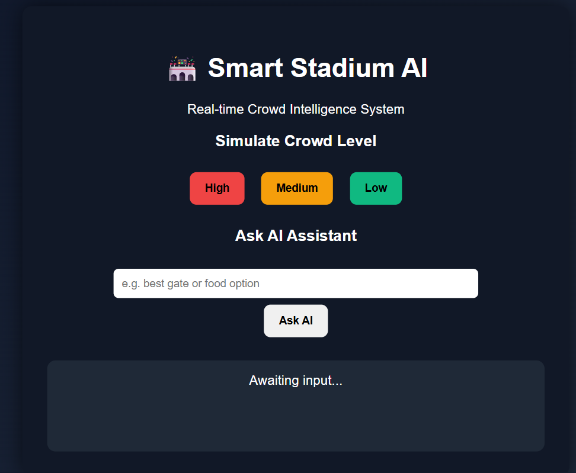
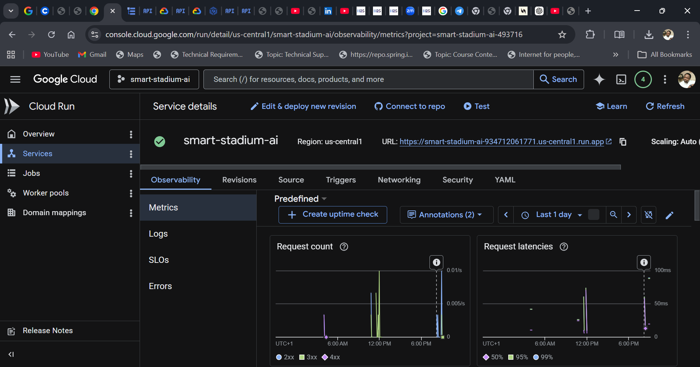
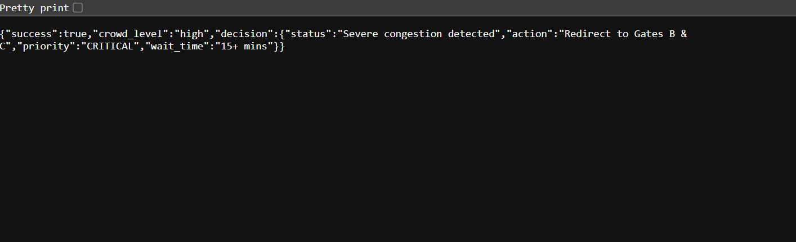
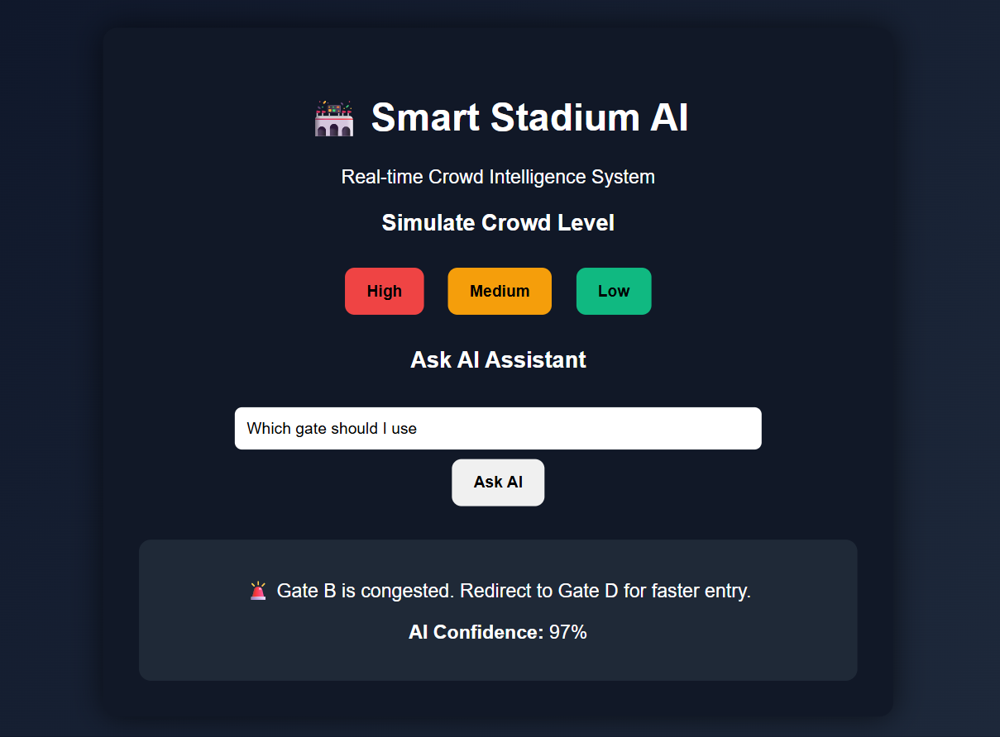

# 🏟️ Smart Stadium AI Agent


## 📌 Overview
Smart Stadium AI Agent is a cloud-native system designed to optimize crowd movement and enhance the event experience in large stadium environments.

It simulates an AI-driven decision engine that analyzes crowd conditions and provides intelligent routing suggestions in real time.

---

## 🚀 Live Application

👉 https://smart-stadium-ai-934712061771.us-central1.run.app

---

## 🧠 Features
- AI-inspired crowd decision engine
- Real-time simulation endpoints
- RESTful API architecture
- Docker containerization
- Automated CI/CD pipeline (Cloud Build → Cloud Run)
- Scalable cloud deployment

---

## 🏗️ Architecture

### Tech Stack
- Backend: Node.js (Express)
- Containerization: Docker
- CI/CD: Google Cloud Build
- Deployment: Google Cloud Run
- Version Control: GitHub

---

## 🔄 System Flow Architecture

```text
Stadium Users (Browser / Client)
│
▼
Node.js Express Application
│
▼
AI Decision Logic Engine
│
▼
Crowd Routing Output
│
▼
Google Cloud Run
│
▼
Public HTTPS Endpoint
```

---

## ⚙️ API Endpoints

### Health Check

```text
GET /health
```


### AI Query

```text
POST /ask
Body:
{
"query": "Where should I enter?"
}
```
### Simulation Endpoint

```text
GET /simulate?crowd=high
```

---

## 📊 Example Response

```json
{
  "success": true,
  "crowd_level": "high",
  "decision": {
    "status": "Severe congestion detected",
    "action": "Redirect to Gates B & C",
    "priority": "CRITICAL",
    "wait_time": "15+ mins"
  }
}

## 🔄 CI/CD (Conceptual Workflow)

```text
Developer Push → GitHub Repository
        │
        ▼
Cloud Build Trigger
        │
        ▼
Docker Image Build & Push
        │
        ▼
Cloud Run Deployment
        │
        ▼
Live Application Update
```
---

📂 Project Structure

```text
smart-stadium-ai/
│
├── server.js
├── package.json
├── Dockerfile
├── cloudbuild.yaml
├── .gitignore
│
├── public/
│   └── index.html
│
└── screenshots/
    ├── homepage.png
    ├── ai-response.png
    ├── simulate-api.png
    └── cloud-run.png
```
---

📸 Screenshots (REQUIRED FOR A+)
1. Live Application
Show browser with your app UI

https://smart-stadium-ai-934712061771.us-central1.run.app/



2. Cloud Run Service
Show deployed service + URL



3. API Test
Show /simulate?crowd=high in browser/Postman



4. AI Response
Show AI response to inputs on the main page



---

## ⚙️ How It Works

1. User interacts with the system via browser
2. Request is processed by Express backend
3. AI logic evaluates crowd conditions using rules
4. System generates routing suggestion
5. Response is returned to user

---

## 🤖 AI Agent Logic

IF crowd_density > threshold  
THEN suggest alternative exit routes

This simulates intelligent decision-making used in real-world crowd management systems.

---

## ☁️ Deployment Overview

- Node.js application built with Express
- Containerized using Docker
- Deployed on Google Cloud Run
- Exposed via secure HTTPS endpoint

---

## 📈 Impact

- Demonstrates cloud-native architecture
- Shows DevOps deployment pipeline understanding
- Applies AI-inspired decision modeling
- Simulates real-world crowd management systems
- Improves crowd safety and flow
- Reduces congestion and wait times
- Demonstrates real-world AI system design

---

## 🚀 Future Improvements

- Integrate real-time IoT crowd sensors
- Replace rule-based logic with ML model
- Fully automate CI/CD with GitHub Actions
- Add monitoring dashboards (Grafana/Prometheus)
- Machine learning-based predictions
- Interactive dashboard visualization
- WebSocket live updates
---

## 🏁 Author

Cloud + DevOps Engineering Project demonstrating end-to-end system design, containerization, and cloud deployment.
